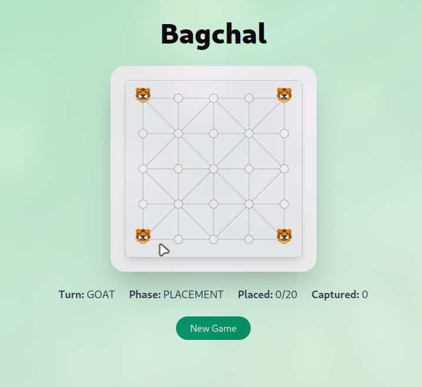

# Bagchal 🦬🐯  
*MVP – April 2025*

Bagchal (Nepali : **बाघचाल**) is the classic “Tigers & Goats” strategy game.  
This repository contains the **minimum-viable product** that lets two local players play a complete round inside the browser.

---

## ✨ MVP Features

| Area | Details |
|------|---------|
| Core rules | 5 × 5 intersection board, 4 tigers begin in the corners, 20 goats are placed sequentially, legal movement & captures enforced |
| Phases | **Placement** (goats only) → **Movement** (both sides) |
| Turn logic | Turn indicator, phase indicator, counters for goats placed & goats captured |
| UI | Responsive board with drag / click & drop, light animation, green gradient background (Tailwind CSS) |
| Game loop | “New Game” button hard-resets state |
| Tech stack | **SvelteKit + TypeScript + Tailwind CSS** (Vite build) |

<p align="center">
  
</p>

---

## 🚀 Quick Start

```bash
# 1. Clone
git clone https://github.com/<your-org>/bagchal.git
cd bagchal

# 2. Install dependencies
pnpm install        

# 3. Run the dev server
pnpm dev            # http://localhost:5173

# 4. Build for production
pnpm build
pnpm preview
```

## 🛣️ Roadmap

Status	Item
🔜	Undo / redo stack
🔜	Basic AI opponent (minimax w/ alpha-beta)
🔜	Drag-&-drop support on mobile
🧭	Online multiplayer (WebSockets + Supabase Realtime)
🧭	Thematic “Bagchal • Reforged” skin with mythic lore
🧭	Accessibility pass (ARIA, keyboard controls)
🧭	PWA packaging & offline support
🧭	Save / resume games via localStorage


🤝 Contributing
Fork & clone, create a feature branch.

Follow the coding style (ESLint + Prettier).

Submit a descriptive PR – the maintainer will review.

All contributions – code, bug reports, suggestions – are welcome!
